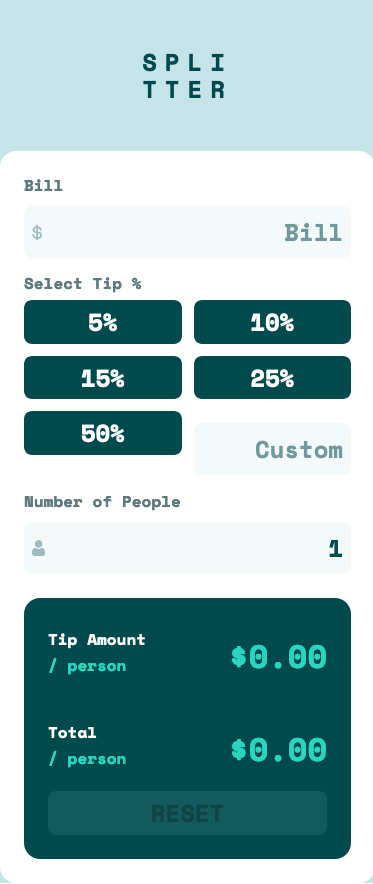
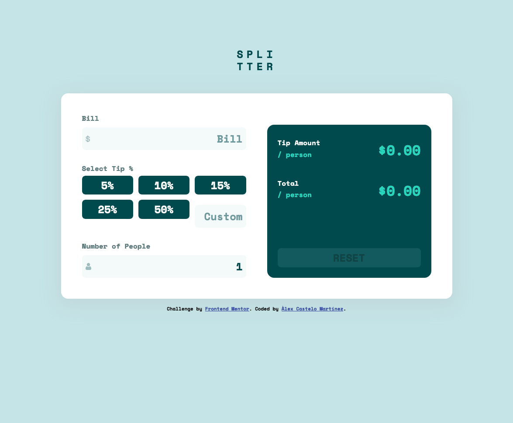

# Frontend Mentor - Tip calculator app solution

This is a solution to the [Tip calculator app challenge on Frontend Mentor](https://www.frontendmentor.io/challenges/tip-calculator-app-ugJNGbJUX). Frontend Mentor challenges help you improve your coding skills by building realistic projects.

## Table of contents

- [Overview](#overview)
  - [The challenge](#the-challenge)
  - [Screenshot](#screenshot)
  - [Links](#links)
- [My process](#my-process)
  - [Built with](#built-with)
  - [What I learned](#what-i-learned)
  - [Continued development](#continued-development)
- [Author](#author)

**Note: Delete this note and update the table of contents based on what sections you keep.**

## Overview

### The challenge

Users should be able to:

- View the optimal layout for the app depending on their device's screen size
- See hover states for all interactive elements on the page
- Calculate the correct tip and total cost of the bill per person

### Screenshot

### Links

- Solution URL: [Add solution URL here](https://github.com/alex-castelo/frontend-mentor-tip-calculator-app)
- Live Site URL: [Add live site URL here](https://alex-castelo.github.io/frontend-mentor-tip-calculator-app/)

## My process

### Built with

- Semantic HTML5 markup
- CSS custom properties
- Flexbox
- CSS Grid
- Mobile-first workflow
- [TypeScript](https://www.typescriptlang.org/)
- [Vue 3](https://vuejs.org/guide/introduction.html) - JS library
- [Vue test utils](https://v1.test-utils.vuejs.org/) - Vue testing framework
- [Vite](https://vitejs.dev/) - As a dev server and bundler
- [Vite](https://vitest.dev/) - As test runner

### What I learned

As always, I like to use the Frontend Mentor exercises to practice new things I want to learn and to review some of them to see if I understand them well or not.

In this case, I'm going to New York soon and I thought it was a good idea to make a web app that I could use myself during my trip.

I wanted to use Vue 3, Vite, Vitest and in general tools from the Vue ecosystem to work together and see how they work. The truth is that it has helped me to understand some concepts of the Vue Testing Library that is built on (vue-test-utils).

It has been a very entertaining challenge.

### Continued development

Surely more tests can be added, components can be refactored or some things can be optimized. Maybe, if the project had to evolve, I would focus on building a CI pipeline (with Github actions), in fact, I think that for the next challenge it will be the first thing I will do.

## Author

- Frontend Mentor - [@alex-castelo](https://www.frontendmentor.io/profile/alex-castelo)
- Twitter - [@jove_nai](https://mobile.twitter.com/jove_nai)
